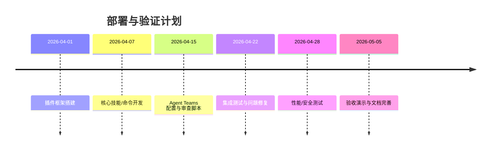

# 执行摘要  
本报告总结了利用 **Claude Code** 构建阶段化 AI 开发流程（**需求 → 澄清 → 设计 → 计划 → 开发 → 测试 → 修复 → 交付**）的可行性与实现方案。我们调研了现有开源方案（如 Superpowers、Ring、ShipSpec、PDForge、ECC 等）和 Claude Code 的内建功能（subagents、agent teams、hooks、MCP、Agent SDK）。通过对比各方案在阶段支持、需求澄清、计划生成、执行/验证、并行审议、hooks控制、易集成性、成熟度、二次开发成本等维度的评分和特性，最终推荐构建一个基于 **Claude Code 插件** 的三层架构：

- **编排层（Orchestration）**：以状态机/控制台为中枢，触发各阶段操作和技能调用；
- **集成插件层（Plugin Integration）**：集合 Superpowers 的需求澄清、ShipSpec 的规格与任务分解、Ring 的 TDD 流程与并行审查、ECC 的质量门控等技能和子代理；
- **控制层（Control）**：负责启动和管理 Agent Teams，使用 hooks 强制执行质量评审（如 TaskCompleted/TeammateIdle 阻断）和集成 MCP（Git/Jira/CI）等外部工具。

方案建议复用上述组件的关键功能，并在定制插件中预装相应的技能和子代理配置。我们提供了详细的实现步骤、示例配置和钩子脚本模板；通过并行审查和质量门禁（参考 Ring 的 7 审查器模型和 ECC 的质量门控）确保方案完备；并设计了包含功能测试、性能测试等在内的部署验收计划及甘特图。最后，列出主要风险与缓解策略，并给出下一步行动建议。所有结论基于 Claude Code 官方文档和各仓库 README/SKILL.md 等原始资料【1†L315-L323】【8†L278-L287】。

## 背景与目标  
- **用户诉求**：构建一个类似瀑布/迭代式的“AI 开发流程”，从**模糊需求**到**交付产品**，每个阶段都有明确产物与质量门槛，并尽可能自动化，减少人工中断。关键阶段包括：需求澄清、方案/规格撰写、实施计划、编码开发、测试验证、缺陷修复、最终交付。  
- **关键约束**：必须可复用现有开源方案并在 Claude Code 环境下运行；接受少量定制开发（技能、钩子等）；优先使用官方支持和现成插件；降低额外学习成本；保障流程安全和质量（防止 AI 自行“发散”）。  
- **可接受的二次开发范围**：可定制 CLAUDE plugin（包括自定义技能、子代理、命令、钩子）；可编写钩子脚本来实现硬阻断；可以编写 MCP 服务器（如 Git/Jira 集成），但需注意安全性。禁止对 Claude Code 源码修改。  
- **优先级**：重点保障需求澄清和开发计划质量，其次为实现阶段的自动化；并行审查和质量门控（如 ECC 的 Continuous Learning）作为质量保障。实现时应先搭建最小可用流程（MVP），再逐步完善优化。

## 调研方法与信息源  
调研主要基于 Claude Code 官方文档、Anthropic 平台文档，以及各插件项目的 README、SKILL.md、示例代码等原始资料。优先搜索中文资料，但考虑到新工具，多数内容以英文原文为主。主要信息源包括：  
- **Claude Code 官方文档**：Hooks 指南、Agent Teams、Plugin 开发文档等【4†L158-L167】【5†L282-L288】；  
- **Superpowers 仓库**（obra/superpowers）：官方工作流插件【1†L321-L330】【1†L333-L342】；  
- **Ring 仓库**（LerianStudio/ring）：涵盖 TDD、调试、并行审查、10 闸门流程【3†L590-L598】【6†L49-L57】；  
- **ShipSpec 仓库**（jsegov/shipspec）：PRD/SDD/任务规划插件【8†L278-L287】【8†L343-L352】；  
- **PDForge 插件**（XRenSiu/claude-code-forge）：7 阶段产品开发流程【6†L314-L322】；  
- **Everything-claude-code**（affaan-m/everything-claude-code）：ECC 插件，提供质量审计和学习机制【10†L1678-L1687】【11†L7-L14】；  
- **Deep Trilogy 文章**（Pierce Lamb, Medium）：社区提出的 3 阶段插件框架示例【13†L49-L58】【13†L143-L152】；  
- **其他开源项目/行业**：包括 Devin（Cognition Labs）、OpenHands 等云端智能开发平台参考资料【9†L0-L8】【9†L1-L9】；  
- **相关论坛与社区**：如 Reddit、博客，作为次要参考。  
调研覆盖的维度：阶段支持、需求访谈、方案编写、计划生成、实施执行、测试与验证、并行协作、质量门控、集成成本、成熟度与社区认可度等。

## 候选方案比较表  

| 方案/组件       | 阶段化支持 | 需求澄清 | 计划生成 | 实施/验证 | 并行审议 | Hooks/阻断 | 易集成性 | 成熟度 | 二次开发成本 | 说明（关键证据） |
|--------------|:--------:|:-----:|:----:|:-----:|:----:|:--------:|:----:|:-----:|:---------:|----------------------------------|
| **Superpowers**【1†L315-L323】【1†L333-L342】  | 高 | 高（Socratic 提问） | 高（自动 PRD、任务） | 高（子代理开发+TDD） | 中（非并行，本质串行） | 低（无内置阻断） | 高（官方插件，Market 一键装） | 高（11.3万⭐） | 低（插件安装即可） | 完整流程：先问需求→生成 PRD 文档，再生成实施计划→启动子代理完成编码测试【1†L321-L330】。强调 TDD、YAGNI、DRY 等【1†L327-L336】。 |
| **Ring**【3†L590-L598】【6†L49-L57】 | 高 | 高（`/brainstorm` 等） | 高（`ring:write-plan`、10闸流程） | 高（TDD、系统调试） | 高（并行 7 人代码审查） | 中（更多为提示，需自定义 Hooks） | 高（Claude 插件/MCP） | 高（2500⭐） | 中（较复杂环境） | 提供 TDD、系统化调试、10 阶段开发周期【5†L1-L4】；**并行审查**：`/ring:codereview` 可发起 7 名审查员并行审查【6†L49-L57】；拥有多种内置技能（82 种核心技能）【3†L590-L598】。 |
| **ShipSpec**【8†L278-L287】【8†L343-L352】 | 高（按步骤设计流） | 高（交互式 PRD 访谈） | 高（自动 PRD/SDD/任务） | 中（按任务序列实现＋验证） | 低（串行任务执行） | 中（内建“Ralph 循环”） | 高（Claude 插件 Market） | 中（400⭐） | 低（插件安装即可） | **规范驱动开发**：通过交互式询问提取需求、生成 PRD 和技术设计，自动分解成任务并附验收标准【8†L343-L352】；**Ralph 循环**：每个任务由子代理执行并验证（失败则重试）【8†L278-L287】。 |
| **PDForge**【6†L314-L322】    | 高 | 中（`/brainstorm` 整体流程） | 高（7 阶段全自动） | 高（TDD + 代码审查） | 中（主要顺序） | 低（依赖内置流程，无额外阻断） | 高（官方插件） | 中（100⭐） | 低（插件安装即可） | **7 阶段流水线**：从思路到部署全流程自动化，包括需求分析、架构设计、任务规划、开发实施（TDD）到部署【6†L314-L322】。可并入 Agent Teams 获得对抗式开发能力。 |
| **ECC (Everything-CC)**【10†L1678-L1687】【11†L7-L14】 | 低（非专流程） | 低（无明确访谈） | 低（无自动计划） | 低（不专注编码） | 低 | 高（质量门控） | 中（需结合 OpenCode/Claude） | 中（300⭐） | 中（配置繁多） | **质量审计与学习**：提供 `/quality-gate` （全局或按路径执行质量检查）、`/harness-audit` 基线评估【10†L1678-L1687】；内置“连续学习”机制自动抽取交互模式和技能【11†L7-L14】。更多作为治理工具，可与流程集成。 |
| **Claude Agent Teams**【5†L282-L288】 | N/A（环境功能） | N/A（环境功能） | N/A | N/A | 高（通过任务列表并发） | 高（`TeammateIdle`/`TaskCompleted` 阻断） | 高（内建功能） | 高 | 低（命令即可） | **并行协作基座**：支持多 Claude 实例组成团队并行完成任务，提供共享任务列表和消息系统【5†L282-L288】。可使用 `TeammateIdle`、`TaskCompleted` 钩子硬阻断以实现阶段审查【5†L282-L288】。 |
| **OpenAI/Codex 系统** | 低 | 低 | 低 | 低 | 低 | 低 | 高（商业成熟） | 高 | 低 | 目前暂无集成级多阶段流程管理，仅提供代码生成能力，无内置需求访谈或阶段审查。可利用 Codex 工具链，但需自行组织流程。 |

上述评分中，“高/中/低”为主观评估，基于官方文档和示例【1†L315-L323】【8†L278-L287】。例如，Superpowers 强调在会话开始阶段 **先澄清需求**【1†L321-L330】，自动分块展示和确认设计文档，之后生成开发计划；而 ShipSpec 则通过结构化对话生成 PRD/SDD 和任务清单【8†L343-L352】。Ring 提供 **7 人并行审查** 功能【6†L49-L57】及严格的 TDD/调试流程。ECC 着重质量门控和经验学习【10†L1678-L1687】【11†L7-L14】。对照可见，综合运用 Superpowers (需求&规格)、ShipSpec (详细设计&任务)、Ring (并行审查&流程）和 ECC (质量门控) 最能满足全流程需求。

## 推荐架构设计  

我们建议采用**三层架构**：编排层、集成插件层、控制层。

```mermaid
flowchart LR
  subgraph 编排层
    A([状态机/流程调度]):::layer
  end
  subgraph 集成插件层
    B([Superpowers: 需求澄清 & PRD]):::layer
    C([ShipSpec: 技术设计 & 任务]):::layer
    D([Ring: TDD & 并行审查]):::layer
    E([ECC: 质量审计 & 学习]):::layer
  end
  subgraph 控制层
    F([Agent Teams & 钩子]):::layer
    G([MCP 集成 (Git/Jira/CI) ]):::layer
  end
  A --> B & C & D & E
  B --> F; C --> F; D --> F; E --> F
  F --> G
  classDef layer fill:#f9f,stroke:#333,stroke-width:1px;
```

- **编排层（薄调度层）**：负责维护开发阶段状态机（INTAKE→CLARIFY→DESIGN→PLAN→EXECUTE→VERIFY→FIX→DONE），根据状态触发相应插件命令。它只做流程切换和日志记录，不承担复杂逻辑。
- **集成插件层**：汇总各组件提供的能力：
  - **Superpowers**（技能）：使用 Socratic 问答技能进行需求澄清和规格分块【1†L321-L330】。  
  - **ShipSpec**（技能&命令）：通过结构化对话生成 PRD/SDD，自动分解任务并附加验收标准【8†L343-L352】。  
  - **Ring**（技能&命令）：提供自动执行的 TDD 循环（`ring:test-driven-development`）和系统化调试，并可用 `/ring:codereview` 发起 7 人并行代码审查【6†L49-L57】。  
  - **ECC**（技能）：执行全局质量审计（`/harness-audit`）和质量门控（`/quality-gate`）【10†L1678-L1687】，并可使用连续学习规则提升项目经验。  
  - **自定义插件**（待开发）：可将上述方法集成到一个插件中，如注册多个技能、子代理和命令。例如，**编排命令**可按阶段分发 `/shipspec:feature-planning`、`/ring:dev-cycle` 等。  
- **控制层**：利用 Claude Agent Teams 并行执行任务，并通过 **钩子（Hooks）** 强制阶段审查。具体策略：  
  - 在 **TeammateIdle** 事件上挂钩，若子代理无待办任务则用 `exit 2` 停顿，提示“还有待解决问题”【5†L282-L288】。  
  - 在 **TaskCompleted** 事件上挂钩，用 `exit 2` 阻断完成并要求验证（如运行测试、合规性检查等）【5†L282-L288】。  
  - MCP 集成（如 Git/Jira CI）：通过配置 `.claude/mcp-servers.json`，在每个阶段提交变更或通知相应系统，确保流程可审计。

下面使用 Mermaid 状态图展示状态机逻辑：  
```mermaid
flowchart TD
  INTAKE([模糊需求收集])
  CLARIFY([需求澄清\n(生成草案规格)])
  DESIGN([技术设计])
  PLAN([实施计划])
  EXECUTE([编码实现])
  VERIFY([测试验证])
  FIX([问题修复])
  DONE([交付完成])
  INTAKE --> CLARIFY --> DESIGN --> PLAN --> EXECUTE --> VERIFY --> FIX --> DONE
  classDef stage fill:#ccf,stroke:#000;
```
以上状态转换由编排层驱动。例如，从 **INTAKE** 到 **CLARIFY**，系统自动调用 Superpowers 技能提问；**PLAN** 阶段触发子代理执行任务列表；在 **VERIFY** 阶段运行测试用例；**FIX** 阶段则让子代理修复问题。钩子会在 **TaskCompleted** 时阻断不合格的完成，保证只有通过验证的结果才能进入下一状态【5†L282-L288】。

## 详细实现方案（步骤清单）  

1. **创建 Claude Code 插件仓库**：  
   - 目录结构示例：  
     ```
     my-harness-plugin/
     ├── plugin.json
     ├── agents/          # 子代理定义 (.md 文件)
     ├── skills/          # Skill 文件夹
     │   ├── clarifier/   # Superpowers 风格需求澄清技能
     │   ├── spec-generator/
     │   └── ...
     ├── commands/        # 如自定义 slash 命令脚本（可选）
     ├── hooks/
     │   ├── task-check.sh
     │   └── idle-check.sh
     └── .claude/         # 或 `.claude-plugin/`
     ```
   - **plugin.json** 示例（包含命令、技能、子代理、钩子等）：  
     ```json
     {
       "name": "stage-harness",
       "version": "0.1.0",
       "description": "阶段化开发Harness插件",
       "claudeApiVersion": "3.0.0",
       "author": "YourName",
       "commands": [
         {"command": "deploy", "file": "./commands/deploy.js"}
       ],
       "skills": [
         {"skill": "需求澄清", "path": "./skills/clarifier/skill.md"},
         {"skill": "任务分解", "path": "./skills/task-planner/skill.md"}
       ],
       "agents": [
         {"agent": "code-reviewer", "file": "./agents/code-reviewer.md"}
       ],
       "hooks": [
         {"event": "TaskCompleted", "script": "./hooks/task-check.sh"},
         {"event": "TeammateIdle", "script": "./hooks/idle-check.sh"}
       ],
       "mcpServers": [
         {"name": "git", "url": "https://api.github.com"}
       ]
     }
     ```  
     其中 `skills` 列表对应我们引入的各技能（可以复用 Superpowers/ShipSpec 等的 SKILL.md）。`agents` 列表定义了需要的 Claude 子代理角色（如：架构师、审查员等）。`hooks` 指定事件与脚本文件（实现质量阻断逻辑）。`mcpServers` 配置外部工具集成。  

2. **安装与配置新 CLI 环境**：  
   - 使用 Claude CLI，执行：  
     ```
     # 添加本地插件（或Marketplace方式）
     /plugin marketplace add my-harness-plugin
     /plugin install stage-harness@my-harness-plugin
     ```  
   - 或者在项目根目录创建 `.claude-plugin/` 并放入上述文件结构。  
   - 确认 `.claude/settings.json` 包含允许的工具（例如允许 Skill、Bash、Read 等）。  

3. **预加载技能与子代理**：  
   - 将 Superpowers/ShipSpec/Ring/ECC 的核心 SKILL.md 拷贝到 `skills/` 目录（可适当简化或自定义）。例如：**需求澄清技能**：  
     ```yaml
     # SKILL.md 示例（需求澄清）
     ```
     ```markdown
     ---
     name: 需求澄清
     description: |
       当开始一个新功能开发时，通过交互式问答确定真实需求和场景。
     ---
     问: 这个功能主要解决什么问题？ 它的目标用户是谁？...
     ```  
     该技能可以参考 Superpowers 中的 Brainstorm 技能【1†L321-L330】。  
   - 代码层面，保证每个技能文件正确放置在 `.claude/skills/` 或插件 `skills/` 下，Claude Code 会自动加载。  

4. **配置 Agent Teams**：  
   - 在流程执行阶段（例如 **EXECUTE** 期间），在 Orchestration 脚本中启动团队。例如：  
     ```
     /team create dev-team size medium
     /team assign tasks from tasks_list.txt
     ```  
   - 主会话（Lead）可监控任务分配、合并结果；团队成员（Teammates）各自执行子任务。  

5. **实现 Hooks（硬阻断）**：  
   - `hooks/task-check.sh`（TaskCompleted 钩子）样例：  
     ```bash
     #!/bin/bash
     INPUT=$(cat)
     verified=$(echo "$INPUT" | jq -r '.verificationState')
     if [[ "$verified" != "passed" ]]; then
       # 阻断完成并反馈
       jq -n '{"hookSpecificOutput":{"hookEventName":"TaskCompleted","decision":"block","reason":"未通过验证，无法完成任务"}}'
       exit 2
     fi
     exit 0
     ```  
     当子代理报告任务完成但“verificationState”不为“passed”时，返回 exit 2，并输出阻断原因【5†L282-L288】。  
   - `hooks/idle-check.sh`（TeammateIdle 钩子）样例：  
     ```bash
     #!/bin/bash
     # 如果团队剩余任务并未完成，则阻止闲置
     INPUT=$(cat)
     tasks_left=$(echo "$INPUT" | jq -r '.pendingTasks')
     if (( tasks_left > 0 )); then
       jq -n '{"hookSpecificOutput":{"hookEventName":"TeammateIdle","decision":"block","reason":"还有未完成任务，请继续工作"}}'
       exit 2
     fi
     exit 0
     ```  
     如果团队尚有待办任务，则禁止队员转空闲，强制他们继续工作【5†L282-L288】。

6. **集成 MCP 服务器（Git/Jira/CI）**：  
   - 在 `.claude/mcp-servers.json` 中配置外部服务（例如 GitHub API、Jira API）。  
   - 例如，使 Agent 在关键节点自动生成 Pull Request：  
     ```
     # .claude/hooks/ci-deploy.sh （假设在 Stop 或 PreCommit 时触发）
     #!/bin/bash
     echo '{"additionalContext": "已准备好代码，开始构建测试并发起 PR。"}'
     exit 0
     ```  
   - 使用 MCP 工具如 `/mcp sync` 将任务和需求同步到项目管理系统。  

7. **引用原方案方法论**：  
   - 将 Superpowers 的“只改需求不改其余”原则（SURGE）和 ShipSpec 的“任务验收标准”实践融入 SKILL 描述或规则文件。  
   - Ring 中描述的“三阶段审查”可通过并行代码审查实现，并将其结果反馈到控制层（示例：并行审查通过后，才允许运行后续任务【6†L49-L57】）。  
   - ECC 的规则和连续学习策略可作为附加策略：如让子代理在每一循环结束后记录经验到 `~/.claude/agent-memory/`，或者利用 `/learn` 命令提取并分析交互模式（参考 ECC “learn”命令【10†L1678-L1687】）。

## 质量把控与审议机制  

为每个关键阶段指定审阅角色和规则，结合钩子强制执行：  

- **需求澄清阶段**：由产品经理角色审核 PRD 草案；检查 completeness（需求完整性）、feasibility（可行性）等；可并行 2 人审阅，至少一人批准后进入设计阶段。  
- **设计/方案阶段**：由架构师和安全工程师审查；重点验证技术决策合理性和安全隐患；任何重大缺陷必须驳回（硬 veto）。  
- **实施计划阶段**：采用 Ring 的**7 审查者模型**，分配给不同角色（规范审核、安全审核、性能审核等）并行审查计划。  
- **开发阶段**：保持 TDD 流程，并让代码审查团队（3 人）并行复查 Pull Request；使用 `TaskCompleted` 钩子阻断不满足测试覆盖/静态分析要求的提交。  
- **测试阶段**：测试负责人（QA）负责测试方案验证，自动化测试未通过则返工。  
- **修复阶段**：BUG 修复后需再次由原问题提出者或 QA 复审通过后方可结束此环节。  

**审议规则（通过/有条件通过/驳回）**：  
- **通过**：满足所有验收标准，无重大缺陷；  
- **有条件通过**：存在小问题，可在不延误进度的情况下后续处理；需附说明；  
- **驳回（硬 veto）**：发现关键缺陷（安全隐患、需求误解等），必须回退重做，终止当前阶段。  

**审阅清单示例（尤其 PLAN 阶段7闸门）**：根据 Ring 建议，Plan 阶段需通过7个质量门：需求完整性、依赖可行性、风险评估、安全合规、测试可行性、文档完备性、团队资源验证。审阅者填报结果并输出 JSON，如：  
```json
{
  "reviewer": "Security",
  "stage": "PLAN",
  "gate": "SecurityCompliance",
  "decision": "approve",
  "comments": "符合公司安全标准"
}
```  
使用并行多审阅机制，在完成Merge或交付前所有审阅通过。例如 Ring 的 `/ring:codereview` 会并行分配审查【6†L49-L57】；我们也可使用类似机制或 Agent Teams。钩子在 **TaskCompleted** 事件中检查所有审阅输出来决定是否允许进入下一个阶段（决策由输出的 JSON 集成到自动化流程中）。

## 部署与验证计划  

**MVP 步骤**：  
- **基础搭建（Week1）**：建立 Clair Code 环境，创建插件仓库框架，配置基本的 agent/skill/hook。  
- **实现核心流程（Week2-3）**：编码需求澄清和计划生成技能；配置 Agent Teams 与基础审查钩子。  
- **集成测试（Week4）**：通过示例功能需求（如“添加登录模块”）运行全流程，验证每一阶段产出与阻断是否正确。  
- **增强和性能测试（Week5）**：集成更多工具（ECC 质量检查、MCP 提交），编写自动化测试场景，评估延迟和成本；进行安全测试（确保钩子无权限绕过漏洞）。  
- **验收演示（Week6）**：在真实代码库上演示自动化流程；完成文档和检查清单。  

**测试用例**：  
- 功能测试：验证从需求描述到交付的全过程结果，如文档完整性、测试覆盖率、版本提交正确性。  
- 集成测试：切换不同组件（Superpowers/ShipSpec/Ring）输入输出相互兼容。  
- 安全测试：模拟未经授权的命令执行，确认钩子有效阻止（参考安全文档【4†L158-L167】）。  
- 性能测试：测量大型项目（上千行代码）执行时间及 token 使用情况，确保流程在可接受范围。  

**验收标准**：流程可成功运行一个示例功能开发案例，满足所有门禁检查且人工干预最小（例如，需求澄清仅需确认阶段无重大重开，所有阻断均正确）。  

**回滚与替代方案**：若插件方案短期内难以稳定，可作为过渡方案使用单机Claude Code结合定制脚本处理核心阶段，然后逐步迁移到正式插件。在更大范围上，可考虑 Agent SDK（参考下述后续工作），或使用 Anthropic 官方 Agent API 实现自定义流程。  



## 风险分析与缓解措施  
- **需求/规则冲突**：不同插件或技能之间策略不一致（如 Superpowers VS ShipSpec 对设计审查标准的不同）。*缓解*：统一制定项目级别 CLAUDE.md 和规则文件，明确优先级，并通过钩子统一监督。  
- **成本与延迟**：多阶段流程和多代理运行会显著增加令牌消耗和延迟。*缓解*：针对 MDP（模型决策点）设计问答，减少不必要的交互；使用 Headless 模式/高效模型；对非关键部分可考虑 Agent SDK 将部分逻辑在本地运行。  
- **团队过度使用**：开启 Agent Teams 会按任务开销比例计费，过度并行可能超预算。*缓解*：在 `agent-teams` 时设置最大成员数和合适的任务粒度；监控 Task 列表长度，避免无效拆分。  
- **ECC 规则手动维护**：ECC 包含大量规则/钩子，更新复杂。*缓解*：采用插件方式部署时仅导入需要的规则子集，或利用 ECC 提供的 `/harness-audit` 检查环境一致性。  
- **钩子注入风险**：恶意或错误钩子可能中断流程或泄露敏感信息。*缓解*：仅安装受信任插件；在 Hook 脚本中避免执行危险命令；审查外部集成的 MCP 配置。  
- **模型输出不确定**：LLM 可能输出不符合预期的代码或文档。*缓解*：严格定义技能和子代理的 system prompt，使用 `Stop` 钩子在发现问题时终止会话【4†L190-L199】；利用 ECC “验证循环”反复测试输出。  

## 参考与后续工作建议  
- **官方文档**：Claude Code Hooks 指南【4†L158-L167】、Agent Teams【5†L282-L288】、Plugin 开发文档【10†L1678-L1687】。  
- **仓库资料**：Superpowers【1†L321-L330】、Ring【3†L590-L598】【6†L49-L57】、ShipSpec【8†L278-L287】【8†L343-L352】、PDForge【6†L314-L322】、ECC【10†L1678-L1687】【11†L7-L14】的 README/SKILL。  
- **示例插件**：Deep Trilogy【13†L49-L58】、Lisa（需求访谈框架）、PRD Workflow 插件等。  
- **Agent SDK 迁移时机**：当需要将此阶段化流程嵌入其他环境或服务端时，可考虑迁移到 **Claude Agent SDK**，以获得更灵活的代码集成、持久化会话与多用户支持【8†L1670-L1678】【8†L1699-L1707】。  
- **扩展方向**：接入更多自动化工具（如静态分析、CI/CD）、构建界面化监控板、研究更智能的决策机制（如动态任务分配、成本优化）等。  

**建议行动清单**：  
1. 按章节详细梳理上述架构和流程，形成项目文档。  
2. 初始化 Claude Code 项目和插件仓库框架，验证插件系统工作正常。  
3. 逐步实现“需求澄清→规格制定→任务拆解”功能模块，并进行单步测试。  
4. 编写并测试 `TaskCompleted` 和 `TeammateIdle` 钩子，实现质量门禁。  
5. 使用样例项目演练整个流程，收集反馈并修正瓶颈。  
6. 最终发布 MVP，并评估是否需要迁移到 Agent SDK 以扩展部署和性能。