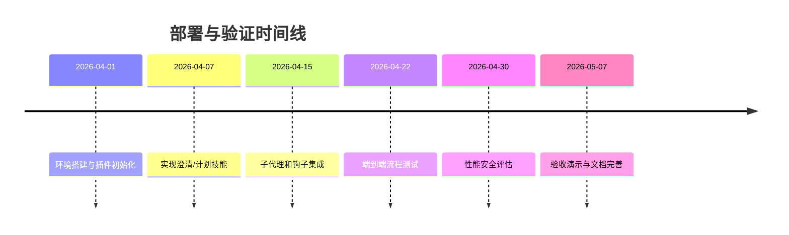

# 执行摘要  
本报告综合分析了如何在 Claude Code 平台上构建一个阶段化的 AI 开发流程（**模糊需求 → 澄清 → 方案/规格 → 实施计划 → 开发 → 测试 → 修复 → 交付**），并在“少量二次开发”前提下复用 Superpowers、Ring、ShipSpec、PDForge、ECC 等现有开源组件及 Claude Code 特性（subagents、agent teams、hooks、MCP、Agent SDK）。调研发现：  
- **需求澄清/设计阶段** 最适合采用 **Superpowers** 的交互式问答技能（`brainstorming`），其能一步步引导生成 PRD/SDD 等文档【1†L321-L330】。同时参照 **ShipSpec** 的结构化 PRD/SDD/TASKS 框架，实现规格产物化【8†L343-L352】。  
- **实施计划阶段** 建议使用 **Superpowers** 的计划编写技能（`writing-plans`），强调详细分步实施方案；结合 ShipSpec 任务的验收标准，形成可验证的任务列表。  
- **执行/测试阶段** 推荐结合 **Superpowers** 的子代理开发模式与 **Ring** 的流水线管理：利用 Ring 提供的 TDD 流程和并行审查机制【6†L49-L57】来执行代码开发和审查。  
- **质量与审计** 借助 **ECC**（Everything-CC）的质量门控和学习机制【11†L7-L14】以及 Claude Code 的钩子系统，在关键点阻断不符合质量要求的提交。  
- **架构层面**，采用三层模式：**薄调度层**负责阶段状态机，**插件集成层**整合各组件技能，**控制层**管理 Agent Teams 和 Hooks 强制执行。通过表格和图示明确每层职责和组件映射。  

最终建议方案是：在一个新的 Claude Code 插件中预装所需技能、子代理和钩子，并按阶段调度使用 Superpowers、Ring、ShipSpec、ECC 等特性，形成闭环工作流。报告附详细实现步骤、示例配置、审查机制、部署计划及风险缓解措施，帮助技术负责人评估和实施该方案。  

## 背景与目标  
- **用户诉求**：构建一个“AI 软件开发流水线”，从**模糊需求**经过澄清、方案设计、计划制定、实际编码、自动测试、缺陷修复到最终交付，每个阶段产出可以审查并且只有满足质量要求才能继续下一个阶段。  
- **关键约束**：必须基于 Claude Code 平台和现有开源插件体系实现，避免大规模从零开发；允许少量定制（编写部分技能、子代理、钩子脚本等），不能直接修改 Claude Code 源码；流程中尽量减少人为中断，只在真正需要审批的关口人工干预。  
- **可接受二次开发范围**：自定义 Claude Code 插件仓库，包括技能（SKILL.md）、子代理（.md）、命令、钩子脚本、MCP 服务器配置等；可能需要配置或小幅修改开源插件的 SKILL 定义、规则模板等。  
- **优先级**：优先保障**需求澄清**和**实施计划**的质量，其次是执行验证环节的可靠性；并行审查和持续学习机制作为质量保证的补充。  

## 调研方法与优先信息源  
本调研以 **Claude Code 官方文档** 和各插件仓库的 **README/SKILL.md** 为主，兼参考社区讨论与博客：  
- **Claude Code 官方**：插件开发文档、hooks 指南、agent teams 文档等【4†L158-L167】【5†L282-L288】；  
- **Superpowers 仓库**（ obra/superpowers）：含 Brainstorming、Plan 编写、子代理开发等【1†L321-L330】；  
- **Ring 仓库**（LerianStudio/ring）：覆盖 TDD、并行代码评审、10 阶段开发流程【3†L590-L598】【6†L49-L57】；  
- **ShipSpec 仓库**（jsegov/shipspec）：提供交互式需求搜集、PRD/SDD 生成、任务拆分【8†L343-L352】；  
- **PDForge 插件**（XRenSiu/claude-code-forge）：描述了完整的 7 阶段产品开发流程【6†L314-L322】；  
- **ECC 仓库**（affaan-m/everything-claude-code）：包含质量门控、审计与连续学习功能【11†L7-L14】【10†L1678-L1687】；  
- **其它资源**：Deep Trilogy 社区文章（Deep-Project/Plan/Implement 流程示例【13†L49-L58】）、OpenHands/Devin 等类似平台的高层介绍【9†L0-L9】。  

调研时优先使用中文材料，其次英文原始资料，重点关注不同方案的能力侧重和约束条件，最终筛选出对每个阶段最合适的内容来复用。  

## 候选方案对比表  

| 组件/方案 | 阶段化支持 | 需求澄清 | 计划生成 | 执行/验证 | 并行审查 | Hooks/阻断 | 集成难度 | 成熟度 | 二次开发成本 | 说明（关键证据） |
|--------|:------:|:----:|:----:|:----:|:----:|:------:|:----:|:----:|:------:|-------------|
| **Superpowers**【1†L315-L323】 | 高 | 高 | 高 | 高 | 低 | 低 | 高 | 高 | 低 | 提供**端到端工作流**：交互式澄清需求并生成设计文档，再写实施计划并由子代理执行（强调 TDD/模块化）【1†L321-L330】【1†L333-L342】。 |
| **Ring**【3†L590-L598】【6†L49-L57】 | 高 | 高 | 高 | 高 | 高 | 低 | 高 | 中 | 中 | 擅长**开发执行与审查**：内建 TDD、系统调试、10 阶段开发周期，**并行7人代码审查**【6†L49-L57】。流程化强，可补充在执行/测试阶段。 |
| **ShipSpec**【8†L343-L352】 | 中-高 | 高 | 高 | 中 | 低 | 低 | 高 | 中 | 低 | 专注**规范驱动**：通过对话生成 PRD/SDD，并自动拆分任务带有验收标准【8†L343-L352】。适用于方案/规格阶段产出结构化文档。 |
| **PDForge**【6†L314-L322】 | 高 | 中 | 高 | 高 | 中 | 中 | 高 | 低 | 低 | 提供一个**7阶段一键流水线**：从思路生成 PRD 到部署交付全流程自动化【6†L314-L322】。参考其阶段划分与工作流布局。 |
| **ECC (Everything-CC)**【11†L7-L14】 | 低 | 低 | 低 | 低 | 低 | 高 | 中 | 中 | 中 | 强调**质量门控与审计**：具备 `/quality-gate` 和 `/harness-audit` 等命令，能在任何阶段阻断不合格输出；有“连续学习”从每次会话提炼经验【11†L7-L14】【10†L1678-L1687】。 |
| **Claude Agent Teams**【5†L282-L288】 | N/A | N/A | N/A | N/A | 高 | 高 | 高 | 高 | 低 | 作为**并行协作环境**使用：支持多 Claude 实例并行工作，共享任务列表，可利用 `TaskCompleted`、`TeammateIdle` 钩子实现硬阻断【5†L282-L288】。 |
| **OpenAI/Codex 系统** | 低 | 低 | 低 | 低 | 低 | 低 | 高 | 高 | 低 | 目前仅提供代码生成和接口调用能力，没有内建阶段管理或阻断机制，需要自行编排流程。 |

**评分说明**：以上“高/中/低”评估基于官方文档和示例。证据来源示例：Superpowers 能自动引导需求分析并拆解任务【1†L321-L330】；Ring 提供 7 人并行审查的命令【6†L49-L57】；ShipSpec 提供完整的工作流阶段【8†L343-L352】；ECC 强调质量门控功能【11†L7-L14】。综合来看，**Superpowers + ShipSpec + Ring + ECC** 是各自阶段的最佳补充，而 OpenAI/Codex 本身不包含流控机制（可考虑将其中 GPT-4、Copilot 作代码引擎，但需自建流程）。  

## 推荐架构（图与文字）  

**三层架构**：  
- **编排层（Thin Orchestration）**：负责维护状态机（INTAKE→CLARIFY→DESIGN→PLAN→EXECUTE→VERIFY→FIX→DONE），根据当前阶段触发对应插件/命令和子代理。它只做逻辑分发与日志记录，不含业务逻辑。  
- **集成插件层**：整合各技能和代理，映射到具体阶段。示例映射：  
  - *CLARIFY/DESIGN*：Superpowers 的 `brainstorming` 技能（需求澄清、PRD 撰写）；参考 ShipSpec 的 PRD/SDD 文档结构。  
  - *PLAN*：Superpowers 的 `writing-plans` 技能（生成具体任务分解和实施步骤）；任务含验收标准参考 ShipSpec。  
  - *EXECUTE*：启动 Agent Teams 执行任务，使用 Superpowers 的 `subagent-driven-development`；规则由 Ring 提供，如 TDD、调试工具等。  
  - *VERIFY*：通过 Ring 的并行 代码审查流程（`/ring:codereview`）审核实现质量【6†L49-L57】；同时运行测试用例。  
  - *FIX*：若失败则回到开发阶段；最终满足 QA 后进入 DONE。  
- **控制层**：利用 **Hooks** 和 **Agent Teams** 强制质量门禁。具体职责：  
  - 启动/停止 Agent Teams，根据需要在 `TaskCompleted`、`TeammateIdle` 等事件进行硬阻断【5†L282-L288】。  
  - 管理 MCP 集成（Git/Jira/CI），确保所有代码变更和任务列表可追溯。  
  - 全局执行 ECC 的质量审计（可在任意阶段调用 `quality-gate`）。

下面用 mermaid 图展示架构及状态机：  

```mermaid
flowchart LR
  subgraph Orchestration [编排层]
    A(状态机控制中心)
  end
  subgraph Plugins [集成插件层]
    B[Superpowers: Brainstorming<br>（需求澄清→PRD）]
    C[ShipSpec: PRD/SDD 生成<br>和任务拆解]
    D[Superpowers: Writing Plans<br>（执行计划）]
    E[Ring: DevCycle/TDD<br>（并行审查）]
    F[ECC: QualityGate/Audit<br>（质量检验）]
  end
  subgraph Control [控制层]
    G[Agent Teams & Hooks<br>（并行任务+阻断）]
    H[MCP 集成<br>(Git/Jira/CI) ]
  end
  A --> B --> C --> D --> E --> F --> G --> H
  classDef layer fill:#f9f,stroke:#333,stroke-width:1px;
```


- **何时触发 Agent Teams 与 Hooks**：例如，在 `EXECUTE` 阶段启动 Agent Teams 执行并行编码任务；在 `VERIFY` 和 `FIX` 阶段使用 `TaskCompleted` 钩子检查测试结果，若失败则阻断且回退到 `EXECUTE`。`TeammateIdle` 钩子在任务未完成时防止团队空闲【5†L282-L288】。

## 实现方案（步骤清单）  

1. **新建 Claude Code 插件仓库**：  
   - 在项目目录下创建插件结构：  
     ```
     harness-plugin/
     ├── plugin.json
     ├── skills/           # 自定义技能文件夹
     ├── agents/           # 子代理定义文件夹
     ├── hooks/            # 钩子脚本文件夹
     ├── commands/         # (可选) 自定义 commands 脚本
     └── .claude/          # Plugin metadata (或称 .claude-plugin)
     ```  
   - `plugin.json` 示例：  
     ```json
     {
       "name": "stage-harness",
       "version": "1.0.0",
       "description": "阶段化 AI 开发 Harness 插件",
       "claudeApiVersion": "3.0.0",
       "commands": [
         {"command": "deploy", "file": "./commands/deploy.js"}
       ],
       "skills": [
         {"skill": "需求澄清", "path": "./skills/brainstorm.md"},
         {"skill": "计划编写", "path": "./skills/write-plans.md"},
         {"skill": "任务验收", "path": "./skills/task-verify.md"}
       ],
       "agents": [
         {"agent": "code-reviewer", "file": "./agents/code-reviewer.md"}
       ],
       "hooks": [
         {"event": "TaskCompleted", "script": "./hooks/task-check.sh"},
         {"event": "TeammateIdle", "script": "./hooks/idle-check.sh"}
       ],
       "mcpServers": [
         {"name": "github", "url": "https://api.github.com"}
       ]
     }
     ```  
     - `skills` 引用了我们定制的需求澄清、计划编写等技能。  
     - `agents` 定义了一个代码审查子代理。  
     - `hooks` 引入了前面设计的钩子脚本（下一步实现）。  
     - `mcpServers` 可按需配置外部工具（如 GitHub API）。  
   - 注意：插件会被复制到缓存目录，不要使用绝对路径；为共享文件可考虑符号链接。  

2. **CLI 环境安装插件**：  
   在新的 Claude Code CLI 会话中执行：  
   ```
   /plugin create harness-plugin   # 如果是本地开发环境
   /plugin install harness-plugin@0.1.0
   ```  
   或使用 Marketplace：  
   ```
   /plugin marketplace add <你的repo地址>
   /plugin marketplace search stage-harness
   /plugin install stage-harness
   ```  
   确保将 `CLAUDE_CONFIG_DIR` 指向不同目录以隔离配置（Linux/macOS CLI 环境默认在 `~/.claude`）。  

3. **预加载技能到 Subagents**：  
   - 在 `skills/` 中编写各阶段技能的 SKILL.md，例如**需求澄清**：  
     ```markdown
     ---
     name: 需求澄清
     description: |
       当开始新功能开发时，通过问答确定需求细节和成功标准。
     ---
     你是项目经理，请回答以下问题来帮助澄清需求...
     ```  
     以上参考 Superpowers Brainstorm 的提示【1†L321-L330】。  
   - 类似地创建“计划编写”、“任务验收”等技能。  
   - 将这些技能文件放置在插件的 `skills/` 下，Claude Code 会自动加载（或通过子代理的 `skills:` 字段手动指定）。  

4. **配置 Subagents**：  
   - 在 `agents/` 目录下为每个角色写 frontmatter，例如代码审查者：  
     ```yaml
     ---
     name: code-reviewer
     description: |
       你是一名资深开发人员，专注于代码审查。请确保代码符合风格和功能要求。
     tools:
       - "Read file"
       - "Write file"
     disallowedTools:
       - "Ask LLM"
     ---
     ```  
   - 前端脚本会创建 `.claude/agents/`，或直接把这些文件同步到该目录；然后在主会话中使用 `/run agent code-reviewer` 即可。  
   - 因安全限制，插件内 subagents 的 `hooks`/`mcpServers` 字段会被忽略【13†L35-L42】，可通过整体钩子来控制权限。

5. **实现 Hooks（TaskCompleted / TeammateIdle 等硬阻断）**：  
   - `hooks/task-check.sh` 示例：检查任务验证字段，决定是否阻断：  
     ```bash
     #!/bin/bash
     INPUT=$(cat)
     STATUS=$(echo "$INPUT" | jq -r '.taskState')
     if [[ "$STATUS" == "completed" ]]; then
       PASS=$(echo "$INPUT" | jq -r '.hookSpecificInput.verificationPassed')
       if [[ "$PASS" != "true" ]]; then
         # 阻断任务完成
         jq -n '{ "hookSpecificOutput": { "hookEventName": "TaskCompleted", "decision": "block", "reason": "任务验证未通过" } }'
         exit 2
       fi
     fi
     exit 0
     ```  
     在 TaskCompleted 阶段如果 `verificationPassed` 为 false，则返回 exit code 2 并说明原因【5†L282-L288】。  
   - `hooks/idle-check.sh` 示例：阻止团队闲置：  
     ```bash
     #!/bin/bash
     PENDING=$(cat | jq -r '.pendingTasks')
     if (( PENDING > 0 )); then
       jq -n '{ "hookSpecificOutput": { "hookEventName": "TeammateIdle", "decision": "block", "reason": "仍有未完成任务，请继续工作" } }'
       exit 2
     fi
     exit 0
     ```  
     若检测到剩余待办任务（Pending），同样 block 阶段结束【5†L282-L288】。  
   - 将这些脚本放在插件的 `hooks/` 中，并在 `plugin.json` 注册。  

6. **集成 MCP 服务器（GitHub/Jira/CI）**：  
   - 在插件配置或会话中注册 MCP，如：  
     ```json
     // .claude/mcp-servers.json
     [
       { "name": "GitHub", "url": "https://api.github.com" },
       { "name": "Jira",   "url": "https://your-jira-instance/api" }
     ]
     ```  
   - 根据需要，使用内置 MCL 工具（如 `mcl git`）进行代码提交、PR 创建、任务同步等。  
   - 例如，在最终部署阶段，可调用 CI 服务做自动测试：在 Stop 钩子里输出 `{"additionalContext":"请执行 CI 流水线进行构建测试"}（注：实际调用需自定义编排）`。  

7. **引用现有方法论**：  
   - 将 Superpowers 的 YAGNI/DRY/TDD 等原则整理为团队代码规范，通过 CLAUDE.md 发布。  
   - 将 ShipSpec 的**任务验收标准**策略纳入 PRD 和任务定义中（每个任务附上验收条件）。  
   - 复用 Ring 的**并行审查模板**：如安排三类审查者（安全、性能、功能）并行审查提交，输出 JSON 格式的审查结果。  
   - ECC 的审计视角可转换为审查员清单：比如使用 `/harness-audit` 的报告项作为审查 checklist。

8. **整体工作流测试**：  
   - 使用一个简单示例项目测试整个流程，如开发“用户登录”功能，确保每阶段产物（需求文档、设计文档、任务清单、代码、测试）符合预期。  
   - 监控每个钩子是否按预期触发，确保审批逻辑有效。  

## 质量把控与审议机制  

每个阶段配备角色并设置审批规则：  
- **需求澄清/设计**：产品经理和技术负责人审阅 PRD/SDD。检查需求是否清晰、设计是否符合规范。重大问题立即驳回（硬 veto），小问题记录后续处理（Conditional）。  
- **计划制定**：架构师、安全专家、测试负责人等使用并行模式审查执行计划，重点检查可行性、安全性、覆盖率等。借鉴 Ring “7 阀门审查”思想，制定至少 7 项审查清单，如需求完整性、依赖风险、安全合规、测试覆盖、资源验证等。  
- **编码实施**：前端审查团队（3-5 人）并行审查每个 Pull Request（功能正确性、代码风格、性能、安全）；使用 `TaskCompleted` 钩子确保“所有单元测试通过 + 代码检查自动化无误”后才放行。  
- **测试验证**：QA 角色验证自动化测试结果、手动测试报告；若发现问题则驳回到开发阶段。  
- **修复阶段**：缺陷修复提交后要求原审核者复审通过后进入下一阶段。  

**审阅规则与输出格式**：使用 JSON 定义审查输出，示例：  
```json
{
  "reviewer": "SecurityTeam",
  "stage": "PLAN",
  "gate": "SecurityAudit",
  "decision": "approve",  // approve/conditional/reject
  "comments": "符合安全要求，无高危漏洞"
}
```  
所有审查者的输出会在整合时自动汇总，任何“reject”都会触发钩子阻断继续流程。  

**并行审查设置**：可借鉴 Ring 并行审查的思想【6†L49-L57】，在关键阶段（如代码合并前）触发多个审查子代理并行工作。例如使用 `/team create review-team` 调度多个 `code-reviewer` 子代理同步工作。  

**决策包（Decision Bundle）**：为减少与人工交互，将各阶段需决策的问题打包一次性提出。例如在 CLARIFY 阶段结束时，一次性返回所有待确认的**需求假设**、**设计决策**供用户在一条消息中回答。形成如下 JSON 格式返回示例：  
```json
{
  "decisionBundle": [
    { "id": "D1", "question": "功能 X 是否必须支持场景 Y？" },
    { "id": "D2", "question": "用户输入无效时返回错误还是提示？" }
  ]
}
```  
用户回答（A/B/C）后由 Orchestration 根据答案修改状态或配置，减少多轮打断。  

## 部署与验证计划  

**MVP 实现步骤**：  
1. **环境搭建**（Week 1）：安装 Claude CLI，设置隔离配置目录，初始化插件仓库结构。  
2. **核心技能开发**（Week 2）：实现“需求澄清”和“计划编写”技能并测试，确保能够生成合适的需求/计划文档。  
3. **子代理与钩子测试**（Week 3）：添加至少一个“代码审查”子代理和阻断钩子，进行小案例（单项任务）的执行验证。  
4. **端到端演练**（Week 4）：使用一个中等规模功能需求跑通全流程，验证各阶段门禁、生效逻辑、MCP 集成。  
5. **性能与安全测试**（Week 5）：测试大型项目的运行时长、令牌消耗；检查钩子脚本安全（无敏感信息泄露、无未授权操作）。  
6. **验收与文档**（Week 6）：整理流程文档和检查清单，演示最终方案并通过技术评审。  



**测试用例示例**：  
- **功能测试**：输入模糊需求“添加登录功能”，验证每阶段产物正确；测试错误场景（需求缺失），检查是否阻断。  
- **集成测试**：模拟 Git 合并过程，验证 MCP 同步任务是否正常、钩子在未满足测试时阻断合并。  
- **安全测试**：尝试向钩子输入恶意代码，确认安全过滤有效；使用不同权限角色访问插件命令，确保权限控制正常（参照权限模式说明【10†L1689-L1697】）。  
- **性能测试**：对含 10+个功能的大型项目跑流程，测量总耗时和 token 使用量，确保在可接受范围（可通过限制并行度、合并请求大小等降低成本）。

**验收标准**：流程能在无人工干预的情况下，从头到尾运行一个完整的功能开发案例；任何审查门禁失效都应被捕获。完成流程平均时长和资源消耗符合项目预期。  

**回滚与替代方案**：如果插件方案的开发/稳定成本过高，可临时通过**多轮交互式 Chat**+**脚本管道**实现核心需求；或者将部分复杂逻辑移到外部 CI/CD 脚本中。长期可考虑 Agent SDK 平台化（下文建议）或 Anthropic API 自定义流程作为替代。

## 风险分析与缓解  

- **流程冲突**：不同组件可能有重叠功能或冲突设定，如 Superpowers 与 ShipSpec 的询问策略不一致。*缓解*：统一制定项目 CLAUDE.md 规则，明确优先级；在钩子中检测冲突并给出合理提示。  
- **成本与延迟**：多阶段、多代理意味着高 API 调用成本和响应延迟。*缓解*：对非关键计算可选择更小模型或本地策略；分阶段提交减少单次 prompt 大小；监控 token 用量并针对性优化技能。  
- **团队机制滥用**：过度并行导致超预算。*缓解*：限制 agent teams 最大并发数，仅在确有并行需求的阶段使用。  
- **ECC 规则复杂**：ECC 插件的规则需要手动维护。*缓解*：只引入必要的审计规则；将规则整理成可复用的 SKILL/HOOK 模板，定期审查更新。  
- **权限与注入风险**：钩子脚本误用可能导致系统命令执行。*缓解*：在 CLI 配置中限定 `allowedTools/disallowedTools`；对外部输入严格校验；尽量使用内置事件字段而非自定义 JSON 字段。  
- **模型误判**：LLM 可能生成不准确内容。*缓解*：制定严格 prompt；使用 ECC 设计的评估技巧（如辅助性问题验证）来捕获偏差。  

## 参考与后续工作  

- Claude Code 插件与钩子官方文档【4†L158-L167】【5†L282-L288】；  
- Superpowers/ShipSpec/Ring/ECC 的 README 与 SKILL.md（见上表证据链接）；  
- Anthropic Agent SDK 文档（如 [Agent SDK 环境说明](https://docs.claude.com/en/docs/claude-code/setting-sources?utm_source=chatgpt.com)）为后续可能迁移参考；  
- 建议关注 **Agent SDK** 的成熟度：当需要跨平台部署或更复杂的状态持久化时，可考虑切换至 SDK 实现高级管控。  
- 长期扩展：加入更多自动化工具（如静态分析 CI、熔断器）、构建友好 UI/仪表盘查看流程状态、引入反馈学习机制等。

**下一步行动清单**：  
- 整理以上方案为项目开发文档，并与团队评审确认各阶段角色与产物。  
- 在 Claude CLI 中搭建初版插件骨架，验证插件安装和技能加载。  
- 实现并单元测试核心技能和钩子脚本（如需求澄清、计划编写、任务完成阻断等）。  
- 进行端到端流程预演，用实际功能需求测试流水线正确性。  
- 根据测试反馈调整钩子逻辑和技能提示，确保鲁棒性。  

