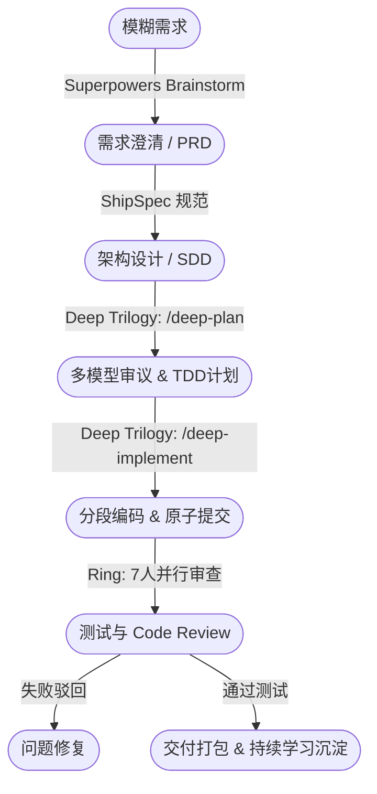

结合这三份文档的核心精髓，我为你梳理了一份**《Claude Code 阶段化 AI Harness 落地实现全景文档》**。这份文档从顶层设计、组件选型到具体的代码配置和部署计划进行了全方位融合，你可以直接将其作为后续开发的**PRD 与架构指导手册**。

---

# Claude Code 阶段化 AI Harness 实现方案 (Master Plan)

## 一、 执行摘要与核心诉求
本方案旨在基于 Claude Code 生态，构建一条**“过程严密、人工打断极少、产物清晰、质量靠硬门禁卡死”**的阶段化 AI 软件工程流水线。

**核心流转节点**：  
`模糊需求 → 需求澄清 → 方案/设计 → 实施计划 → 编码执行 → 测试验证 → 缺陷修复 → 交付完成`

**四大核心原则**：
1. **最小化人工打断**：拒绝流水线中途的频繁反问，仅在关键阶段出口（澄清定稿、计划拍板、交付前）输出打包的 **Decision Bundle（决策包）** 供真人一次性审批。
2. **强硬的质量门禁 (Hard Gates)**：拒绝 AI 的“口头完成”，通过 `TaskCompleted` 和 `TeammateIdle` 等钩子（Hooks）配合 `exit 2` 实现硬阻断。
3. **沉淀可审查产物**：每个阶段必须吐出对应的实体 Artifact（PRD、架构文档、TDD 计划、测试报告）。
4. **少量二开 & 插件化拼装**：不修改 Claude Code 源码，以**自建集成插件**为主干，按需将 Deep Trilogy、Superpowers、Ring、ECC 等开源方案作为“可插拔模块”吸收进流水线。

---

## 二、 整体架构设计

采用**“三层架构”**，实现流程编排、能力组合与权限控制的解耦。

### 1. 架构分层
* **编排层（Orchestration）**：作为薄调度层，维护开发阶段状态机。它不处理具体业务，仅根据当前状态流转（INTAKE → CLARIFY → ... → DONE）去调用对应的集成插件。
* **集成插件层（Integration Plugins）**：汇总各路开源方案的最强能力，映射到具体阶段（例如前置用 Superpowers，计划执行用 Deep Trilogy，审核用 Ring/ECC）。
* **控制层（Control）**：管控底层运行环境。利用 Agent Teams 并发执行，利用 Hooks 拦截违规状态，利用 MCP 服务器集成外部工具（Git/Jira/CI）。

### 2. 状态机与组件映射


---

## 三、 核心组件库选型与融合策略

你的策略是“以我为主，按需吸收”。以下是各阶段推荐吸收的开源模块：

1. **CLARIFY & DESIGN (澄清与设计)**
   * **吸收对象**：Superpowers (`brainstorming`) + ShipSpec。
   * **用法**：使用苏格拉底式提问引导用户，最终严格对齐 ShipSpec 的文档结构生成 PRD 和 SDD，并在阶段末尾输出 `Decision Bundle`。
2. **PLAN & EXECUTE (计划与执行) —— 核心重点**
   * **吸收对象**：Deep Trilogy (`deep-plan`, `deep-implement`) + Superpowers。
   * **用法**：你极度看重“实施计划”。用 `deep-plan` 引入“外部多模型 Review + TDD 驱动”生成详细阶段拆解；用 `deep-implement` 保证“分段原子提交（Atomic Commits）和可恢复性”。
3. **VERIFY & FIX (验证与修复)**
   * **吸收对象**：Ring。
   * **用法**：引入其“7闸门审查”和并行 Reviewer 机制（基于 Agent Teams），对代码进行安全、性能、逻辑的并发审查。
4. **AUDIT & LEARN (审计与持续学习)**
   * **吸收对象**：ECC (`quality-gate`, continuous-learning) + aio-reflect。
   * **用法**：采取双轨制学习。利用 ECC 做流程治理（提取候选技能 → 等待人工晋升）；利用 aio-reflect 做会话复盘（定期分析历史 Session 转化为项目 `.claude/rules`）。

---

## 四、 详细实现步骤（工程落地指南）

### Step 1: 初始化“自建集成插件”框架
建立你自己的 `stage-harness` 插件库，作为所有引入能力的载体。
```text
harness-plugin/
├── plugin.json          # 插件总注册表
├── skills/              # 存放提炼好的 Superpowers/ShipSpec 等 Prompt
├── agents/              # 存放 Ring 风格的代码审查子代理
├── hooks/               # 存放核心的阻断脚本
└── commands/            # 存放调度状态机的 JS/Bash 脚本
```

### Step 2: 解决安全限制与 Agent 下发
> **关键注意**：Claude Code 插件内的 Subagents 会忽略 `hooks/mcpServers` 的 Frontmatter。
* **策略**：在安装/初始化时，提供一个 `setup` 脚本，将强依赖独立权限的 Agents 复制到用户/项目的 `.claude/agents/` 目录下；其余轻量级行为则通过全局 Hooks 配合 State 文件（如 `.harness/state.json`）来控制。

### Step 3: 编写核心 Hooks（实现硬阻断与决策包）
在 `plugin.json` 中挂载事件：
```json
"hooks": [
  {"event": "TaskCompleted", "script": "./hooks/task-check.sh"},
  {"event": "TeammateIdle", "script": "./hooks/idle-check.sh"}
]
```
**防御“口头完成”（task-check.sh 示例）**：
```bash
#!/bin/bash
INPUT=$(cat)
# 从状态文件中读取当前阶段和门禁要求
VERIFIED=$(echo "$INPUT" | jq -r '.hookSpecificInput.verificationPassed')

if [[ "$VERIFIED" != "true" ]]; then
  # 硬阻断并要求验证
  jq -n '{"hookSpecificOutput":{"hookEventName":"TaskCompleted","decision":"block","reason":"未通过自动化测试与并行 Code Review，禁止结束任务"}}'
  exit 2
fi
exit 0
```

**聚合打断（Decision Bundle 理念）**：
在每个大阶段的终点（如 DESIGN 结束），强制 AI 收集所有悬而未决的变量，输出标准 JSON 格式供人类选择，而不是在聊天的中间反复询问：
```json
{
  "decisionBundle": [
    { "id": "D1", "question": "数据库方案选定", "options": ["PostgreSQL", "MongoDB"] },
    { "id": "D2", "question": "容灾策略是否需要高可用？", "options": ["是", "否"] }
  ]
}
```

### Step 4: 集成外部审计与交付 (MCP)
在 `.claude/mcp-servers.json` 中配置 GitHub / Jira / GitLab 的 MCP。要求模型在 PLAN 阶段同步建 Jira Ticket，在 DONE 阶段自动提交带 Release Notes 的 PR。

---

## 五、 质量把控与多角色审议机制

各阶段门禁不可妥协，实施如下卡点：

| 阶段关口 | 审议角色 (Agent/Human) | 审核内容 | 阻断机制 (Veto) |
| :--- | :--- | :--- | :--- |
| **PRD 定稿** | 产品经理 Agent + **真人 (决策包)** | 需求完整性、模糊边界澄清 | 真人未确认，禁止进入 Design |
| **架构与计划**| 架构师 Agent + 安全专家 Agent | Ring的7闸门审查（安全性、可行性、测试覆盖率等）、多模型复核 | 任意 Agent 输出 Reject，状态机回退 |
| **编码合并** | 并行 Review 团队 (3 Agents) | 静态检测、TDD测试是否全绿 | `TaskCompleted` 读取测试报告失败 `exit 2` |
| **全量交付** | ECC Quality Gate | 历史审计基线对比、代码防注入扫描 | 测试、安全漏报则打回 |

---

## 六、 部署计划与风险控制

### MVP 六周落地路线图
* **Week 1-2 (基建与澄清)**：搭建 `harness-plugin` 框架，调通状态机。把 Superpowers / ShipSpec 的需求澄清、文档生成 Prompt 封装为第一批 Skills。
* **Week 3 (计划与执行)**：引入 Deep Trilogy 的思想，实现基于 TDD 的任务拆解清单，打通“分段执行与原子提交”。
* **Week 4 (门禁与审查)**：编写并挂载 `TaskCompleted` 与 `TeammateIdle` Hooks，引入并行的 Review Agents。
* **Week 5 (持续学习)**：集成 ECC 和 aio-reflect 机制，跑通“会话复盘 -> 提取经验 -> 人工审核 -> 更新 rules”闭环。
* **Week 6 (端到端验收)**：输入一个真实的“新增某业务功能”模糊需求，无干预跑通全流程（仅在预设的 3 个 Decision Bundle 处人工交互）。

### 核心风险与缓解措施
1. **Token 成本与 API 延迟**：Agent Teams 并发和多阶段 Review 极其耗费 Token。
   * *缓解*：严格限制 Agent 并发上限；在非核心审查环节（如拼写检查）使用较小的模型（如 Haiku / Fast）；将长文上下文进行阶段性清理。
2. **钩子(Hooks) 安全风险与越权**：
   * *缓解*：遵循权限最小化，限制插件的 `allowedTools`；在 Hooks 中严禁解析未转义的终端命令，防范注入攻击 (Prompt Injection)。
3. **规则膨胀与冲突**：持续学习可能导致 `.claude/rules` 互相打架。
   * *缓解*：严格执行“双轨制”——机器只能建议（提名为 Candidate），必须由技术负责人人工确认（晋升）后才能合并至系统规则库。

---